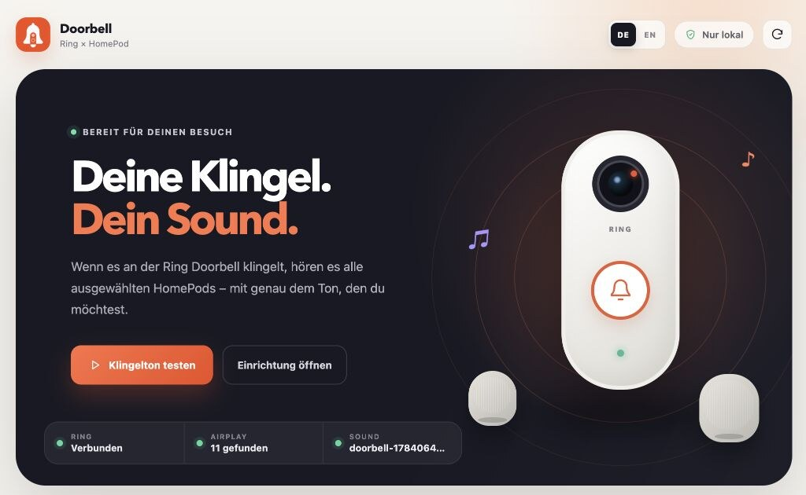
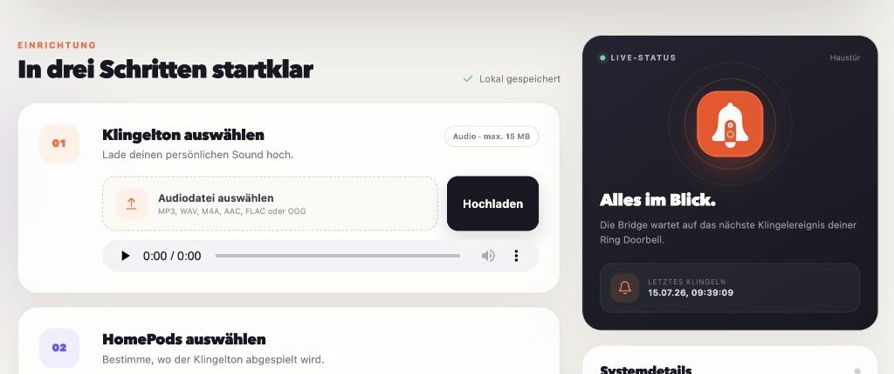

# Ring HomePod Doorbell

A self-hosted bridge for:

```text
Ring doorbell press → custom chime → selected HomePods
```

**Website:** [doorbell.klickwerk.digital](https://doorbell.klickwerk.digital)

**Install:** [Runtipi](#install-on-runtipi) · [Docker Compose](#run-locally-with-docker-compose)

The app receives doorbell events through `ring-client-api`. A dedicated
OwnTone service plays the uploaded audio file in sync across multiple AirPlay
speakers. The web interface manages the chime, HomePod selection, volume, and
a cooldown that prevents duplicate Ring events. The entire interface can be
switched persistently between English and German.

## Web interface



The home page shows the Ring, AirPlay, and chime status at a glance. The
language switch changes the complete interface between English and German.



Configure the chime, speakers, volume, and cooldown directly in the browser.
All settings remain local on your own server.

The public marketing website is a static, tracking-free GitHub Pages site. Its
source lives in [`website/`](website/) and is deployed automatically after
changes are pushed to `main`.

## Support

If you enjoy the project and would like to support its continued development,
you can tip me a coffee through Stripe:

[](https://buy.stripe.com/00w8wOcsV8WHdr7apqaZi04)

## Requirements

- A Ring account with a configured doorbell
- HomePods and the Runtipi server on the same local network/VLAN
- Apple Home: **Home Settings → Speakers & TV → Anyone On the Same Network**
- Docker Compose or Runtipi

> The Ring integration uses an unofficial API. Changes made by Ring may
> therefore require a future app update.

## Generate a Ring refresh token

Run the following command on a trusted computer with Node.js installed:

```bash
npx -p ring-client-api ring-auth-cli
```

The token is a secret and must never be committed to Git.

## Run locally with Docker Compose

```bash
cp .env.example .env
nano .env
docker compose up -d --build
docker compose logs -f
```

Then open `http://YOUR-SERVER-IP:8585`, upload an audio file, select the
HomePods, and press **Test chime**.

Persistent data is stored in `data/`:

- `data/settings.json`: speaker and playback settings
- `data/media/`: uploaded chime
- `data/owntone-cache/`: OwnTone database and AirPlay state
- `data/ring-refresh-token.txt`: automatically updated Ring token

## Install on Runtipi

This repository also serves as a custom Runtipi app store. In Runtipi, open
**Settings → App Stores** and add this URL:

```text
https://github.com/alexholzreiter/ring-homepod-doorbell
```

Runtipi then discovers the app in:

```text
apps/ring-homepod-doorbell/
├── config.json
├── docker-compose.yml
├── owntone.conf
└── metadata/
    ├── description.md
    └── logo.jpg
```

The `runtipi/` directory contains the same app definition as a standalone,
copyable package.

The app uses the container image
`ghcr.io/alexholzreiter/ring-homepod-doorbell:0.2.12`. The workflow
`.github/workflows/container.yml` publishes it for `amd64` and `arm64` when
the Git tag `v0.2.12` is pushed.

For every app release, `tipi_version` must also be incremented in both Runtipi
`config.json` files. Runtipi uses this integer revision counter to offer
updates for installed apps and refresh their displayed version.

After the first release, the container package on GitHub must be public so
Runtipi can pull it without registry authentication.

Runtipi must allow host networking. OwnTone requires it to discover HomePods
through mDNS and establish AirPlay connections. The app is intentionally not
exposable to the internet through Runtipi.

## Optional Apple HomeKit chime

Setting `HOMEKIT_ENABLED=true` also publishes a virtual HomeKit doorbell. Once
paired, Apple can play its standard chime on the HomePods. This is not required
for custom audio playback and may result in two consecutive chimes when
enabled.

Pairing in Apple Home:

1. Open **+ → Add Accessory → More Options**.
2. Select `Ring Haustür`.
3. Enter the `HOMEKIT_PIN`.

## Behavior and limitations

- OwnTone takes over the AirPlay output for the duration of the chime. This
  may interrupt music already playing on a HomePod.
- The volume and the outputs previously selected in OwnTone are restored after
  the chime finishes.
- An empty speaker selection with the “All” option enabled includes every
  discovered AirPlay device, potentially including Apple TVs and other
  AirPlay speakers.
- When using separate VLANs, mDNS and the dynamic AirPlay ports must be routed
  between the server and the HomePods.

## Development

```bash
npm install
npm test
docker compose config
docker build -t ring-homepod-doorbell:test .
```

Status endpoints:

- `GET /api/status`
- `GET /health` (`200` when Ring and OwnTone are connected; otherwise `503`)

## License

Ring HomePod Doorbell is open-source software licensed under the
[MIT License](LICENSE). Copyright © 2026 Alexander Holzreiter.
